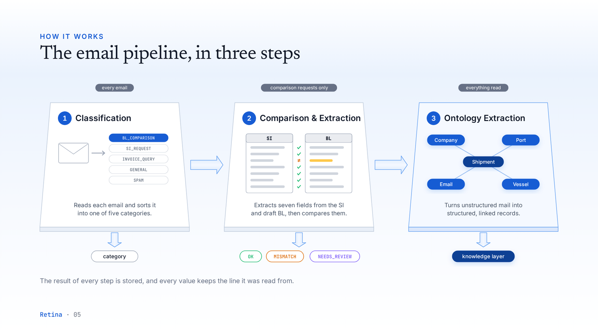
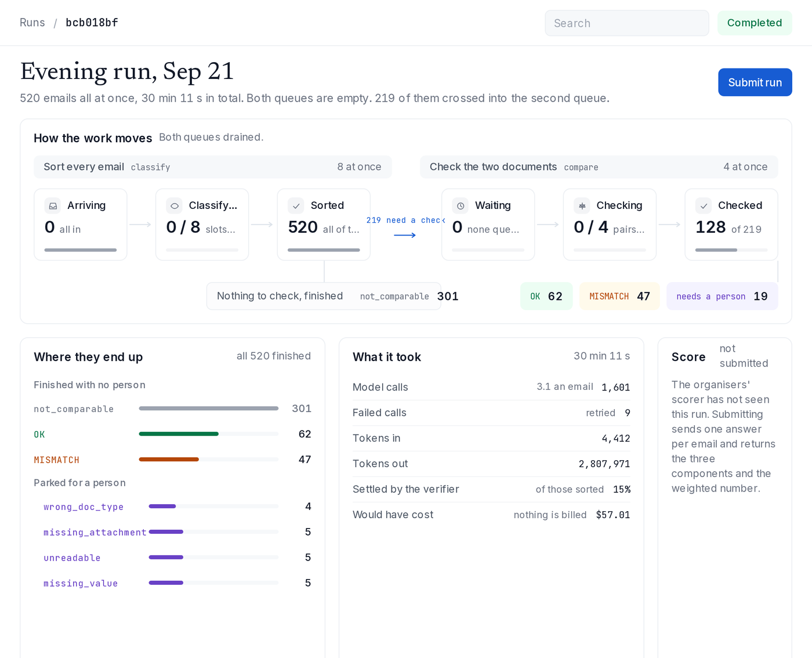
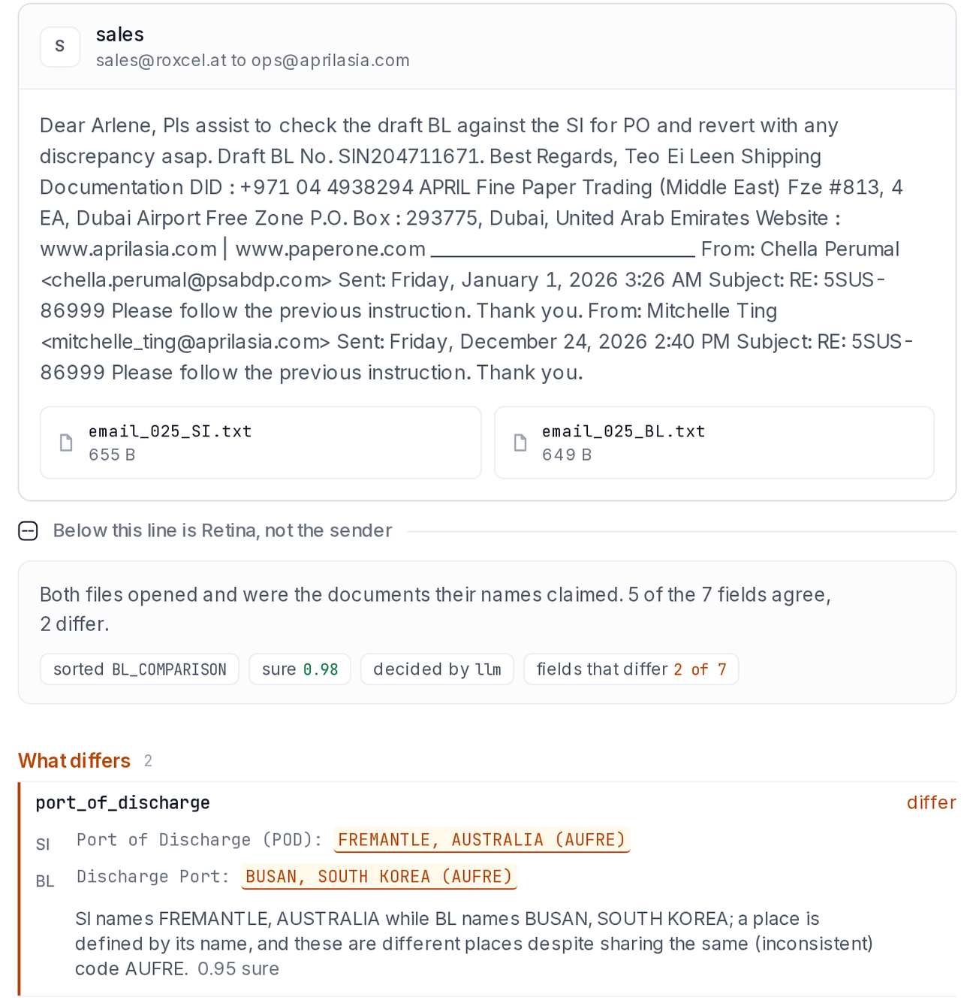
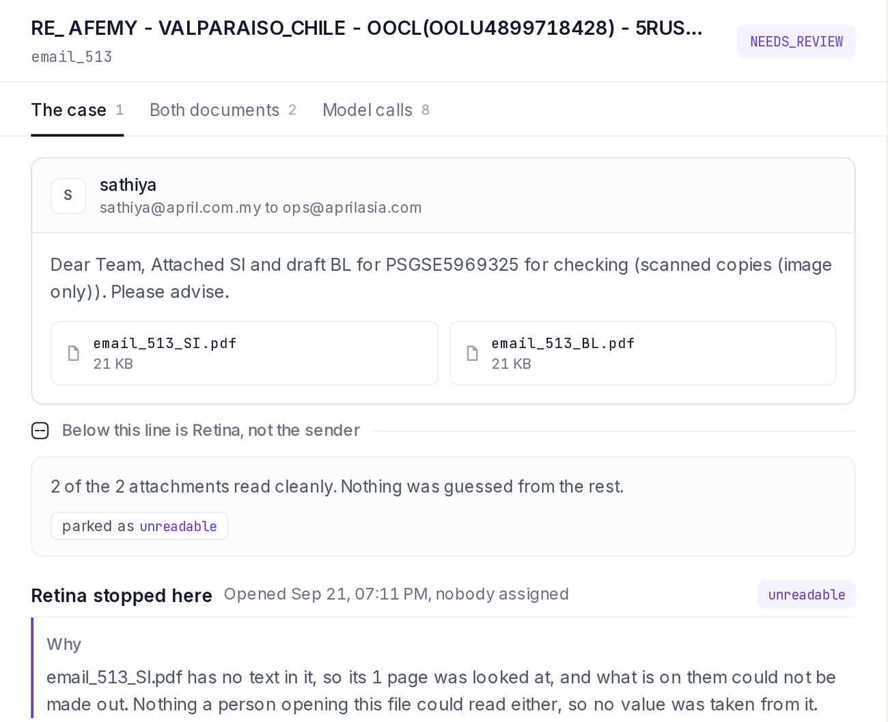
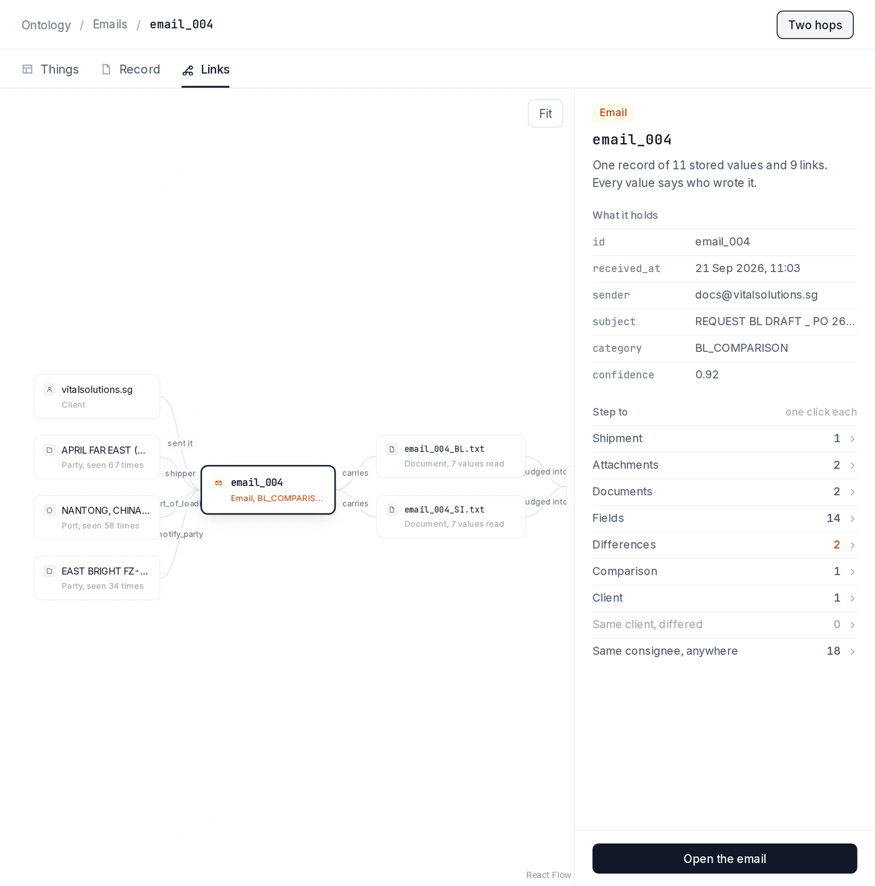
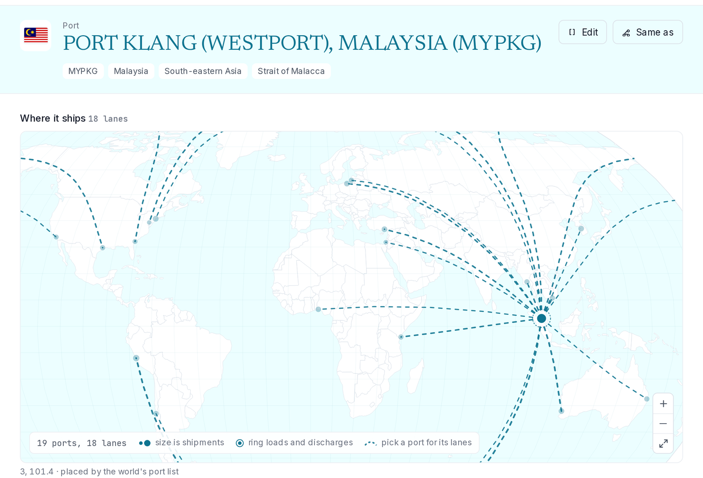
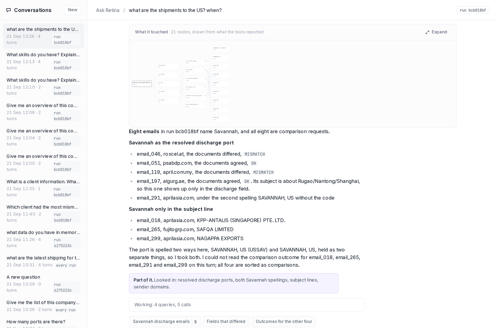
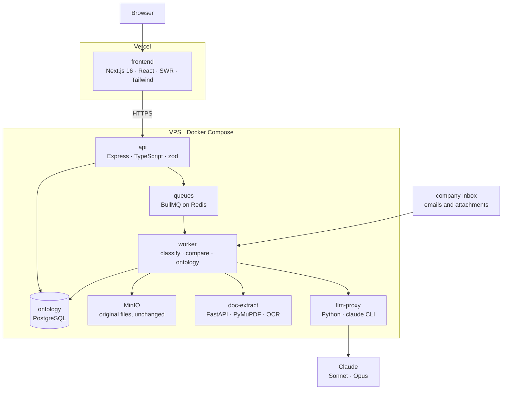

<div align="center">

# Retina

**Your mail already holds your business data. Retina makes it readable, checkable and askable.**

A data ontology layer over a shipping operations inbox: it reads every email and attachment,
checks the documents that need checking, and turns the whole inbox into companies, ports,
vessels and shipments anyone can ask questions about.

[Live demo](https://retina-silk.vercel.app) · [Pitch deck](docs/pitch/deck.pdf) · [Product](docs/01-product.md) · [Architecture](docs/02-infra-overview.md)


Built for the Averis x Monash AI Hackathon by **Max and a Dream**.

</div>

---

## The problem

A shipping operations team runs on one shared inbox, and the work inside it is manual.

- **Finding data is hard.** Staff search the inbox email by email to find one shipment's documents.
- **Every check is done by hand.** Each draft Bill of Lading is compared against its Shipping
  Instruction field by field. One miss costs amendment fees, a delayed release, or demurrage.
- **The data is unstructured.** Values arrive missing, in different formats, and under different
  wording, so nothing downstream can use them.

The data a company wants is already sitting in the inbox. What is missing is something that reads it.

## What Retina does

| Step | What it means |
|---|---|
| **01 Observe** | Reads every email and attachment, and keeps the original untouched. |
| **02 Understand** | Works out what each email is asking for. |
| **03 Structure** | Turns documents into fields, each one linked back to the line it was read from. |
| **04 Verify** | Compares the two documents and flags what differs or is missing. |
| **05 Answer** | Builds a map of companies, ports and shipments that anyone can ask in plain words. |

## How it works



Every email is classified into one of five categories. Only a comparison request crosses into the
second queue, where the seven shipment fields are read out of the Shipping Instruction and the
draft Bill of Lading and compared. Everything read, whatever the category, is folded into the
ontology. The result of every step is stored, and every value keeps the line it came from.

## The product

### A run replays the inbox, and the page shows the work moving



A run pins a prompt version and a model per step, so two prompts can be compared on the same
520 emails. The page shows both queues live, where every email ended up, and what the run cost.

### One email, checked, and the verdict unfolds back to the quoted line



Above the line is the mail as it arrived. Below it is what Retina made of the two documents, in
one plain sentence. Here Fremantle in the instruction and Busan in the draft sit under the same
stale code, and the judge names the place with its confidence. The other five fields agree and
fold away. A tab lists every model call behind the verdict with its prompt version, latency and tokens.

### A difference and an uncertainty are never the same event



A scanned page that came back from OCR under the floor is `unreadable`, not a mismatch. A field
the customer left blank is `missing_value`, and the pair is not judged on it. A person can confirm,
correct a value, reclassify, upload a readable file, retry, or leave a note. A correction sits
beside the model's reading, never over it, and every action is an append-only record of what a
person decided and why.

### The mail becomes things, and every value says who wrote it



The source wrote the sender, a model wrote the category, code wrote the status, and the record
says so for each. From one email you step to its shipment, its documents, its client, its ports.
Across the 520-email inbox that is 208 shipments, 33 ports, 31 parties, 36 people, 10 vessels and
8 carriers. Nobody typed any of them in.

### Companies, ports and shipments get their own pages



What our mail shows is kept apart from general knowledge, which is marked unverified. Two
spellings of one port become one port only through a judge's verdict or a shared UN/LOCODE,
never through string matching. A person can rename, merge or edit any of them, and the edit
outlives every rebuild.

### Ask Retina answers over the ontology, and shows its work



Twelve tools over a read-only role: find a thing, run a recipe, run guarded SQL, explain a
decision. The queries and their rows sit under every answer, and coverage is stated rather than
implied ("part of it, looked in: resolved ports, both spellings, subject lines"). The dock is open
on every page and reads what the page is about, so "why did this need a person?" is one click.

## Why this approach

- **It reads. It has no rules to break.** No sender lists, no keyword tables, no regex over a body,
  no label map, no string matching between spellings. A fresh inbox with a different seed is the
  same job, because nothing was fitted to this one.
- **Every verdict walks back to the line.** A value without a quote in the document is dropped, not
  stored. A join between two spellings needs a verdict. Trust on a document of title needs exactly this.
- **The check is the entry, the ontology is the product.** Checking documents produces typed
  companies, ports, lanes, vessels and shipments as a side effect. The same reading answers
  "who ships to Savannah" without another integration.
- **It is measured, priced and gated.** A prompt change is a run with a score. A call is a row with
  a cost. An email is priced from counts, sizes and sender history before a model reads it, and
  held when a budget cannot pay for it.

## Results

The full 520-email inbox, scored with the organisers' formula.

| | |
|---|---|
| **0.9975** | final score, against the 0.55 baseline shipped with the kit |
| **30 min** | for 520 emails, 1,601 model calls, 8 classified and 4 compared at once |
| **$57** | at list price, and 15 percent of the sorting settled by the verifier |
| **0** | rules fitted to the dataset |

Measured on run `bcb018bf` and scored locally with the organisers' own scoring code, which
`pnpm eval:parity` proves equal to their `score_cli.py`. The scoreboard submission is pending.
Development happens on the train split; the holdout is read last.

## Architecture



Only the api leaves the server. Every external system sits behind one interface with one real
implementation and one fake for tests.

| Package | What it is | Port |
| --- | --- | --- |
| `frontend/` | Next.js app. Calls the backend with a shared secret. | 3000 |
| `backend/` | Express API, plus a worker that runs the pipeline off Redis queues. | 8091 |
| `proxy/` | LLM gateway on the Anthropic wire, driving `claude -p`. Runs as the `llm-proxy` container. | 4001 |
| `emails/` | The inbox: a FastAPI server over the synthetic shipping-documents dataset. | 8080 |
| `services/doc-extract/` | The parser. Every attachment becomes text (txt, pdf with OCR, docx, xlsx) or is declared unreadable. | 8000 |
| `deploy/` | Scripts and runbook for the server. | |

Each package has its own dependencies, `.env` and start command. Always `cd` into a package
first. Nothing runs from the repo root.

## Quick start

You need Node 24 and pnpm 11 (`corepack enable`), Docker, and a Claude subscription token for the
proxy container: run `claude setup-token` once on a machine logged in to the account and keep what
it prints.

**1. Backend, with the stack**

```bash
cd backend
cp .env.example .env                            # then set CLAUDE_CODE_OAUTH_TOKEN in it
docker compose -f compose.local.yaml up -d      # postgres 5433, redis 6379, minio 9000, inbox 8080, llm-proxy 4001, doc-extract 8000
pnpm install && pnpm db:migrate && pnpm dev     # the api on :8091
```

The llm-proxy is built from `proxy/`. After changing anything there, rebuild it with
`docker compose -f compose.local.yaml up -d --build llm-proxy`. A `provider_not_logged_in` error
from it means the token is missing or expired, and every pipeline call fails the same way.

**2. Worker**, a second terminal in `backend/`. It consumes the queues; without it a run is
created and never moves.

```bash
cd backend
pnpm dev:worker
```

**3. Frontend**

```bash
cd frontend
cp .env.example .env.local
pnpm install && pnpm dev                        # :3000
```

Open http://localhost:3000 for the inbox and http://localhost:3000/runs to start a run and watch
it move. The default keys in the two `.env.example` files match each other; change both or neither.

The provider is the limit, not the worker, so use a run's `limit` for a quick look and expect the
full inbox to take around half an hour. If the proxy goes down mid-run the worker pauses that
queue for 30 seconds and puts the job back with its attempts untouched, so the run carries on
once the proxy is back.

<details>
<summary><b>Running a different inbox</b></summary>

The email server takes its dataset as configuration and the api only ever reaches it over HTTP,
so a different set is a mount and never a code change. `INBOX_DATA` says which:

```bash
cd backend
INBOX_DATA=../emails/data_5k docker compose -f compose.local.yaml up -d inbox
curl -s 127.0.0.1:8080/health          # {"status":"ok","emails":5000,"scoring_available":true}
docker compose -f compose.local.yaml up -d inbox    # unset: back to the organisers' 520
```

Nothing else moves. The api picks the new count up on its next health check without a restart,
ingest lists what the server lists, and `POST /runs/:id/submit` scores against whichever answer
key that set mounted. The `dev` and `holdout` subsets are offered only against the organisers'
520, because the split under `eval/` names that set's ids and no other's.

`emails/data_5k` is a 5,000-email set built in the same shape as the organisers' kit: one year of
threaded mail over 1,398 shipments, with 414 mismatches and 104 cases for a person. It is **not in
git** (145 MB, and it carries an answer key of its own). Two things to know before a full run:

- **It is about ten times the work.** Roughly 13,000 model calls against the 520 set's 1,351, so
  near two hours and ten times the cost. Use a run `limit` first.
- **The committed eval split names the 520's ids.** `pnpm eval:split` writes `eval/split.json`, so
  running it against another key overwrites the split every published number was measured on.
  Copy it aside first.

</details>

## Models

Aliases are model names, and they live in `proxy/proxy.yaml`.

| Alias | Runs on | Needs |
| --- | --- | --- |
| `sonnet`, `opus`, `haiku` | Claude Code subscription, from the llm-proxy container | `CLAUDE_CODE_OAUTH_TOKEN` |
| `test` | nothing | nothing |

Every LLM step in the pipeline runs `sonnet`; the chat runs `opus`. `costUsd` on a call is what the
API would have charged, and nothing is billed. There are no hand-written classification rules: the
model reads the email, and the eval harness measures it.

<details>
<summary><b>API reference</b></summary>

All routes except `/health` need `Authorization: Bearer <key>`. The key is `API_SHARED_SECRET`
(frontend) or `TEAM_API_KEY` (you, curl, scripts).

| Route | Body to result |
| --- | --- |
| `GET /health` | `{ status: "ok" \| "degraded" \| "down", checks, version, queues }`. A check is `{ status, latencyMs }` plus what that dependency says about itself: `inbox` its email count, `docExtract` its tesseract build, `llmProxy` its alias count, `worker` its last heartbeat. 503 only when postgres or redis is down, which is what auto-deploy rolls back on; everything else is `degraded` and still 200 |
| `GET /shipments`, `GET /shipments/:emailId`; `GET /ontology/:kind` for six kinds; `GET /ontology/party/:id/people\|ports`, `/ontology/port/:id/parties` | the business pages' readers: shipments as the mail states them, a kind's list with attributes, summary and roles, and what sits beside a thing |
| `PATCH /ontology/:kind/:id/attributes`, `POST /ontology/:kind/:id/rename`, `POST /ontology/:kind/:id/merge` | a person correcting a thing from its page, each with `actor` |
| `GET /clients`, `PUT /clients/:domain` | every sender domain seen, with its tier, kind and counts, and `known: false` for one nobody has ranked. The `PUT` takes `{ name?, tier?, kind? }`. A tier orders the queue and decides no category |
| `GET /gate` | what the admission gate is doing: the mode, today's model spend against `GATE_DAILY_BUDGET_USD`, the global bucket, and how many decisions it reached and holds it is sitting on |
| `GET /gate/senders`, `PUT /gate/senders/:principal` | every sender the gate has an opinion about, with the standing it earned and today's units against its cap. The `PUT` takes `{ scope: "address" \| "domain", policy: "auto" \| "allow" \| "block", note? }`. `auto` is the absence of a decision |
| `GET /gate/held`, `POST /gate/held/:id/release` | the emails nobody has paid to read yet, and letting one through. A second release of the same row is a 409 |
| `GET /review`, `GET /review/stats`, `GET /review/:id` | the cases waiting for a person, the queue's own numbers, and one case with its evidence and its history |
| `POST /review/:id/actions`, `POST /review/:id/upload` | what a person does to a case: confirm, correct a field, reclassify, note, retry, reopen, or supply a document. 409 when the case is not in a state where the action means anything |
| `GET /files/*key` | streams one object from MinIO: an attachment, a reviewer's upload, or a rendered page |
| `GET /ai/models` | `{ models: [{ id, provider, model }] }` |
| `POST /ai/chat` | `{ model, messages, system?, maxTokens? }` to `{ text, model, stopReason, usage, costUsd }` |
| `GET /emails?q=&filter=attachments&page=&limit=` | `{ emails: [{ id, from, subject, snippet, attachmentCount }], total, page, limit, counts }` |
| `GET /emails/:id` | `{ email_id, from, subject, body, attachments }` |
| `GET /emails/attachments/:name` | the file |
| `POST /runs` | `{ ratePerSecond?: 0-50, limit?, emailIds?, subset?: "dev" \| "holdout", promptSet?: { classify: "v3" }, models?: { classify: "haiku" } }` to a run summary. `0` is a burst. Repeated `emailIds` are dropped. The prompt version and model of every step are pinned at creation |
| `GET /runs`, `GET /runs/:id` | `{ id, status, ratePerSecond, totalEmails, stageCounts, queues, llm, lastSubmission, createdAt, startedAt, finishedAt }`. `queues` is `null` when Redis cannot be reached; `llm` is the model calls, tokens and cost of the run; `lastSubmission` carries the headline scores |
| `POST /runs/:id/pause`, `/resume`, `/cancel` | the run summary, or 409 when the status does not allow it. A pause stops both queues as well as the ingest loop and aborts the model calls already in flight; a resume wakes what it parked. A resume that cannot queue its job answers 503 and leaves the run `paused` |
| `POST /runs/:id/rename` | `{ name }` up to 80 characters to the run summary. An empty name takes it back to being named by when it started |
| `POST /runs/:id/submit?force=false` | sends the run to the organisers' scorer, giving `{ submissionId, finalScore, scoreboard }`. 409 while the run is still ingesting, and 409 `{ incomplete }` while emails are unfinished, both unless forced; 409 while an earlier submission of the same run is still being scored. 502 when the scorer refuses, which leaves an unscored submission row pointing at the stored payload |
| `GET /runs/:id/submission.json` | the payload as it would be sent now: `{ email_id: { category, status, review_reason, has_defect, defect_fields, decided_by } }`, the organisers' enums only |
| `GET /runs/:id/submissions` | `{ submissions: [{ id, finalScore, nEmails, forced, createdAt, scoreboard }] }` |
| `GET /eval/runs/:id` | 404 unless this api can reach the answer key (`EVAL_GROUND_TRUTH_PATH` on a dev machine, `EVAL_GROUND_TRUTH_URL` on the box): the run scored locally, `{ full, holdout, run, wrong }` |
| `GET /runs/:id/emails?stage=&category=&decidedBy=&q=&page=&pageSize=` | `{ emails: [{ emailId, from, subject, stage, attachmentCount, outcome, category, decidedBy, confidence, verifierCategory, error }], total, page, pageSize }` |
| `GET /runs/:id/calls?after=` | the run's newest model calls as summaries, for a live feed |
| `GET /runs/:id/live` | the run's model calls running now, each with the answer written so far |
| `GET /runs/:id/emails/:emailId/trace` | one email: stage, the verdict (each reader's answer), the call running now, and every model call with its system prompt, input, answer, final JSON, tokens and cost |
| `GET /prompts` | each prompt step's versions on disk, the active one marked |
| `POST /chat/conversations`, `GET /chat/conversations?runId=` | open a conversation `{ title?, runId?, emailId?, actor }`, or list them. `runId` and `emailId` are its scope: a default the agent may widen, never a filter it cannot see past |
| `POST /chat/:id/messages` | `{ content, actor }` to `{ turn, exhausted }`. One turn is up to eight model calls and can take minutes; there is no streaming. The turn carries the answer, the SQL that produced it, every tool call, and the graph of what it touched |
| `GET /chat/:id`, `DELETE /chat/:id` | the thread with its turns, and delete |
| `GET /ontology/types` | the types the rail offers, with live counts: Emails, Ports, Parties, Carriers, Vessels, Commodities, People and Shipments |
| `GET /ontology/:type/:id` | one object in the one shape every type shares: stored values each saying who wrote it, and the links out of it |
| `GET /ontology/port/:id/detail` | what is stored, what it is (its profile and attributes, each saying whether it was read in our mail or known already), step out from here, written these ways, and where it appeared |
| `GET /ontology/email/:id/graph?runId=&hops=1\|2` | the email one or two hops out, as nodes and named edges. No coordinates: the layout is the frontend's |
| `GET /database/tables`, `/tables/:schema/:name?limit=&offset=` | every relation of `core` and `analytics` with an exact count, and a page of one with typed columns and the SQL that produced it |
| `GET /database/tables/:schema/:name/rows/:id` | one row as fields, then what points at it by foreign key |

```bash
curl -s 127.0.0.1:8091/ai/chat -H "authorization: Bearer $TEAM_API_KEY" \
  -H 'content-type: application/json' \
  -d '{"model":"haiku","messages":[{"role":"user","content":"hello"}]}'
```

</details>

<details>
<summary><b>Common tasks</b></summary>

| Task | Where |
| --- | --- |
| Add a model alias | `proxy/proxy.yaml`, then rebuild the llm-proxy container |
| See what the gate would hold, spending nothing | `cd backend && pnpm gate:drill --emails 20` |
| Turn the gate on | `GATE_MODE=enforce` in `backend/.env`, then restart the worker. It defaults to `observe`, which records every verdict and holds nothing but a blacklist |
| Add a table | new file in `backend/db/migrations/`, then `pnpm db:migrate` |
| Add a backend route | a router in `backend/src/routes/`, mounted in `backend/src/app.ts`; its shapes in `backend/src/contracts.ts`; then call it from `frontend/lib/api-client.ts` |
| Add an env var | `backend/src/config.ts` (the only reader) and `backend/.env.example` |
| Score a run locally | `pnpm eval:score --run <id> [--holdout]` in `backend/`. Needs `EVAL_GROUND_TRUTH_PATH` |
| Prove the scorer port | `pnpm eval:parity` in `backend/`: `src/eval/score.ts` against the organisers' `score_cli.py` |
| Change how emails are classified | a new version file in `backend/src/agents/prompts/classify/`. Never a rule in code. Check it on train ids, read the holdout last |
| Run the backend tests | `pnpm test` in `backend/`, with `compose.local.yaml` up. They use the database `retina_test` |
| Measure a burst | `pnpm load-test [--limit N]` in `backend/`: starts a run at rate 0, then prints its elapsed time, peak queue depth, the peak model calls in flight and any 429s. Needs one worker running, and only one |
| Change who is served first | `/clients` in the app, or `PUT /clients/:domain`. A tier orders the queue; it never decides a category |
| Add a page | `frontend/app/(app)/`, under the layout that mounts the rail and the chat dock once. Everything run-scoped lives under `runs/[id]/`; the business data cluster is global |
| Regenerate the emails | `emails/data_v2/README.md` |
| Check types | `pnpm type-check` in `frontend/` or `backend/`. `pytest` in `proxy/`; `uv run pytest && uv run ruff check .` in `services/doc-extract/` |
| Change how a document is parsed | an extractor in `services/doc-extract/extractors/`, then `docker compose -f compose.local.yaml up -d --build doc-extract` in `backend/` |
| Debug the proxy | `curl -i 127.0.0.1:4001/v1/messages ...`. Look at the `X-LLM-Proxy-*` headers |
| Rebuild the analytics views and the ontology | `pnpm derive` in `backend/`. The worker does it every five minutes when `core` has moved; this is for straight after a deploy and before a demo |
| Place every port and code every company from the reference lists | `pnpm ontology:locate` in `backend/`. Free and idempotent |
| Read the mail's shipments into the ontology | `pnpm ontology:backfill [--limit N]` in `backend/`, with a worker running. It spends tokens |
| Check the semantic layer at scale | `pnpm ontology:bench` in `backend/`: 200,000 things and 2,000,000 sightings inside a transaction that is rolled back, then `explain analyze` on the four lookups a question makes |
| Measure the chat | `pnpm eval:chat [--set ontology] [--limit N]` in `backend/`. The `chat` set asks about the work, the `ontology` set about the things. Both spend tokens |
| Change what the chat can read | `backend/src/agents/chat/schema-docs.md` for what it is told, and a `grant` migration for what it may actually read |
| Add a chat tool | a file in `backend/src/agents/chat/tools/`, added to the registry in its `index.ts`. `src/mcp.ts` serves the same registry, so it appears over MCP with no second definition |
| Use the tools from Claude Code | `.mcp.json` at the repo root already configures them. `pnpm mcp` in `backend/` runs the server by hand |

</details>

## Deploy

Push to `main`.

- Vercel builds `frontend/`. Set `BACKEND_URL`, `API_SHARED_SECRET` and `SITE_PASSWORD` in the
  Vercel project. The inbox is public; `SITE_PASSWORD` is the one shared password for `/chat` and
  `/runs`.
- GitHub Actions type-checks both packages, runs the backend suite against a Postgres service
  container, builds the frontend, runs the proxy's tests and publishes the backend image. The same
  gates run on a pull request.
- The server pulls every 3 minutes, builds the api image from the same checkout, runs `api` and
  `worker` beside postgres, redis, minio and the email server, and rolls back if `/health` does not
  come up. See [deploy/README.md](./deploy/README.md).
- Changing a deploy script? Run it first: `cd deploy/sim && ./sim.sh up && ./sim.sh test` puts
  `auto-deploy.sh` and `bootstrap-wizard.sh` through a replica of the box, rollback included.

## Docs

| | |
|---|---|
| [`CLAUDE.md`](CLAUDE.md) | how this repo is built, and the rules any change must hold to |
| [`docs/SDOC_BRIEF.md`](docs/SDOC_BRIEF.md) | the problem and the data, every number verified |
| [`docs/01-product.md`](docs/01-product.md) | what the product does, and for whom |
| [`docs/02-infra-overview.md`](docs/02-infra-overview.md) | how it is put together, at a high level |
| [`docs/03-infra-deep.md`](docs/03-infra-deep.md) | contracts, schema, routes |
| [`docs/04-phases.md`](docs/04-phases.md), [`docs/PROGRESS.md`](docs/PROGRESS.md) | the work list, and where it stands |
| [`docs/05-design.md`](docs/05-design.md) | the design language the product and the deck share |
| [`docs/pitch/`](docs/pitch/) | the pitch deck |

## Rules of the road

- Never delete, truncate or drop anything in any database without asking. Schema changes are new
  migration files, forward-only and expand/contract.
- No secrets in git. `.env*` is ignored, and `.env.example` holds placeholders only.
- The answer key (`emails/data_v2/ground_truth.json`) is `eval/`'s alone to read, and is never
  mounted into the api or the worker.
