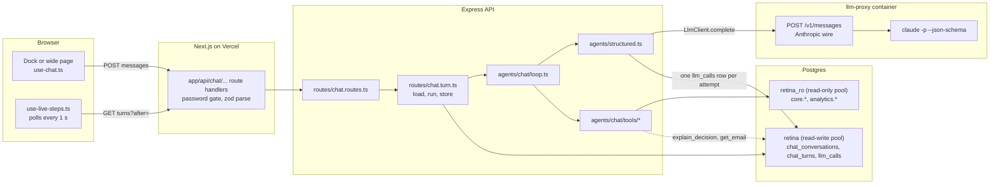
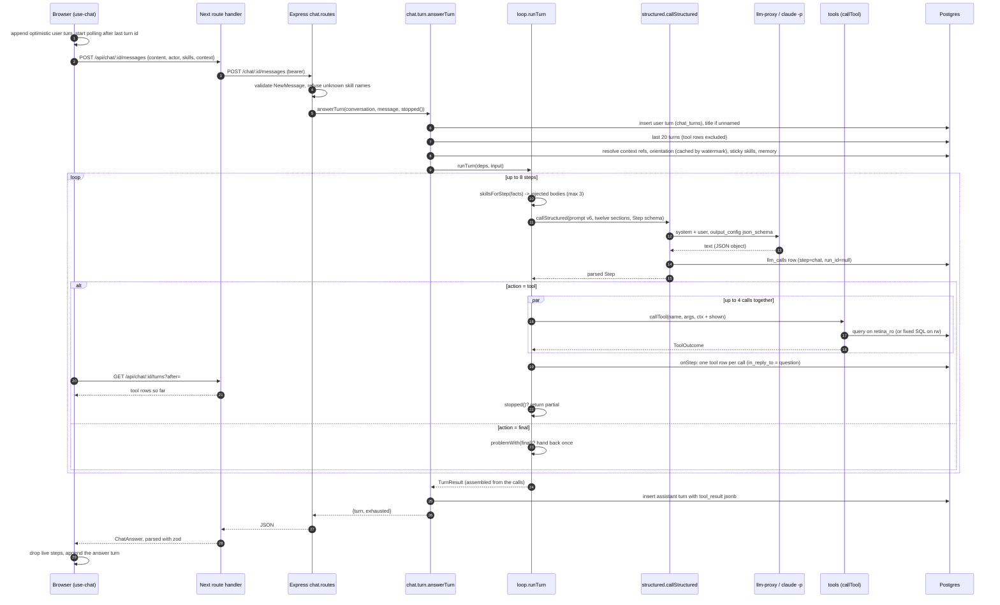
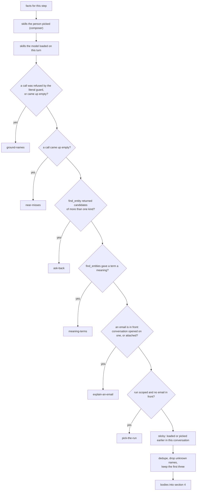
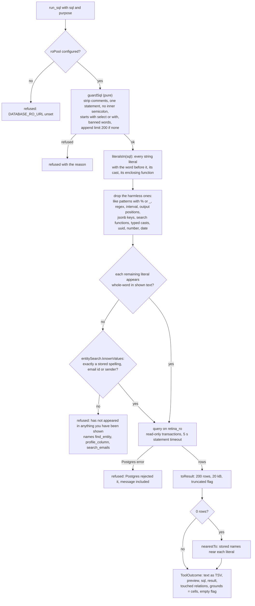
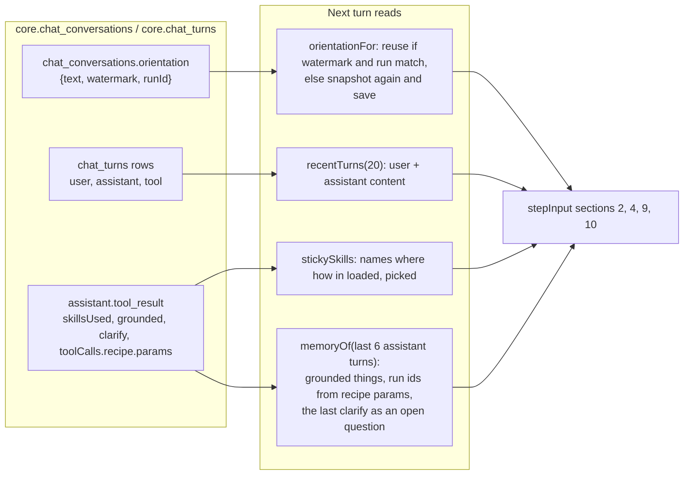

# How the chat interface works

A report on the "Ask Retina" chat as the repository builds it today, written before changing
the prompt, the skills or the tools. Every statement here was read from the code on `main` at
commit `931177f`. Where a design doc says something else, the last section lists it.

The short version: a chat turn is a small agent loop in the Express API. The model is handed a
large, fixed briefing plus the question, and answers one JSON object per step. A step is either
one to four tool calls, which the harness runs against Postgres and feeds back, or the final
answer. The harness, not the prompt, is what keeps it honest: a read-only role, a SQL guard, a
literal guard that refuses filters on strings the model was never shown, skills injected on
events the harness can see, and a final check that drops any suggested next move whose thing and
number did not come back from a tool. Nothing streams. The browser polls for the finished steps
while its own POST waits for the answer.

## 1. The pieces and where they live

| Piece | Path | What it is |
|---|---|---|
| Loop | `backend/src/agents/chat/loop.ts` | Runs the steps of one turn. `MAX_STEPS = 8`, prompt version `v6` |
| Step schema | `backend/src/agents/chat/loop.steps.ts` | The one flat JSON object the model may say per step. `MAX_CALLS = 4` |
| Prompt input | `backend/src/agents/chat/loop.input.ts` | The twelve labelled sections the model reads before the question |
| Result assembly | `backend/src/agents/chat/loop.result.ts` | Turns what happened into the stored turn, off the calls rather than the model's account |
| System prompt | `backend/src/agents/prompts/chat/v6.md` | The role, the writing rules, the step protocol. Runs on the `opus` alias |
| Standing instructions | `backend/src/agents/chat/CHAT.md` (version 3) | How to work in this database: how to start a turn, how the mailbox stores things, rules of evidence, what it cannot do |
| Schema notes | `backend/src/agents/chat/schema-docs.md` | Hand-written notes on the analytics views and core tables, with example questions and SQL |
| Orientation | `backend/src/agents/chat/orientation.ts` | What the database holds right now, computed from SQL and cached on the conversation |
| Skills | `backend/src/agents/chat/skills/<name>/SKILL.md` | Twelve prompt files with a `when` card and a body |
| Recipes | `backend/src/agents/chat/skills/<name>/recipes/<name>.sql` | Twenty named, parameterised, tested queries |
| Skill injection | `backend/src/agents/chat/inject.ts` | Which skill bodies go in front of the model, from facts the harness can see. `MAX_INJECTED = 3` |
| Tools | `backend/src/agents/chat/tools/` | Twelve tools behind one registry in `tools/index.ts` |
| SQL guard | `backend/src/agents/chat/sql-guard.ts` | What a model-written query may be |
| Literal guard | `backend/src/agents/chat/grounding.ts`, `tools/grounded.ts` | Whether a filter value was shown to the model or guessed |
| Next moves | `backend/src/agents/chat/next-moves.ts` | Drops invented alternatives; hands back unsupported claims |
| Memory | `backend/src/agents/chat/memory.ts` | What earlier turns grounded, rendered for the model |
| Context | `backend/src/agents/chat/context.ts` | What the person was looking at, resolved to one line each |
| Structured call | `backend/src/agents/structured.ts` | One model call constrained to a zod schema, with one retry |
| LLM client | `backend/src/agents/llm-client.ts`, `backend/src/llm.ts` | Concurrency cap, transient retry, the proxy client |
| Route | `backend/src/routes/chat.routes.ts`, `chat.turn.ts` | The HTTP surface, and one turn end to end: load, run, store |
| Repositories | `backend/src/ontology/repositories/chat.*.ts` | `chat_conversations` and `chat_turns`, tool rows, orientation cache, sticky skills, memory |
| Contracts | `backend/src/contracts.chat.ts`, `contracts.chat-agent.ts` | The wire shapes, mirrored in `frontend/lib/api/chat-*-schemas.ts` |
| Frontend hook | `frontend/components/chat/use-chat.ts`, `use-live-steps.ts` | Ask, poll the steps, stop, hold the turns |
| Frontend surfaces | `frontend/components/dock/dock.tsx`, `frontend/app/(app)/runs/[id]/chat/chat-page.tsx` | The 380px dock on every page, and the wide page |
| Composer | `frontend/components/chat/composer.tsx`, `slash.ts`, `skill-picker.tsx` | The question box and the `/` skill menu |
| Turn view | `frontend/components/chat/turn.tsx` and siblings | Graph, reading, answer, outcome, clarify, SQL blocks, tools used, next moves |
| MCP | `backend/src/mcp.ts` | The same tool registry served over stdio to Claude Code |
| Eval | `backend/src/eval/chat-*.ts` | `pnpm eval:chat` runs question sets through the real loop and scores behaviour |



## 2. One turn, end to end

The POST holds until the answer. There is no queue and no stream. Steps become visible because
the loop writes each finished tool call as a `role = 'tool'` row the moment it finishes, and the
page polls for rows newer than the question it just asked.



Two details that matter for anyone changing this:

- **Cost attribution.** Every step is one `llm_calls` row with `step = chat`, `project = chat`
  and `run_id = null`, even when the conversation is about a run. A run's cost is what the
  pipeline spent on it, not what somebody asked afterwards.
- **Stop.** The browser aborts its own POST. Express sees `close` before a response was sent,
  the loop reads the flag between steps, and the turn is stored with `outcome: partial`. A model
  call already in flight finishes and is paid for. The client then re-reads `?after=` to pick up
  what landed.

## 3. What the model is given on every step

There are two texts on the wire. The **system prompt** is `prompts/chat/v6.md` with the Step
schema's JSON Schema pasted where the file says `{{schema}}`. The **user message** is twelve
labelled sections in a fixed order, rendered as `## label` blocks by `structured.ts`. The whole
briefing is resent on every step of every turn. Nothing is cached between steps except in the
proxy.

```mermaid
flowchart TB
  subgraph sys["System prompt (fixed per process)"]
    v6["prompts/chat/v6.md<br/>role, writing rules, step protocol"]
    schema["JSON Schema of Step<br/>from loop.steps.ts via zod"]
    v6 --> sysout["system"]
    schema --> sysout
  end
  subgraph user["User message: twelve sections, in this order"]
    s1["1 Standing instructions<br/>CHAT.md body"]
    s2["2 Orientation<br/>orientation.ts, cached per conversation"]
    s3["3 The skills, and the recipes each brings<br/>one card per skill: when + recipe names"]
    s4["4 Skills for this turn<br/>injected bodies, or a line saying none"]
    s5["5 Every recipe, as run_recipe takes it<br/>signature lines"]
    s6["6 The schema you may query<br/>schema-docs.md"]
    s7["7 The tools you have<br/>description + args signature per tool"]
    s8["8 The scope of this conversation<br/>run, email, context lines, today"]
    s9["9 What this conversation already knows<br/>memory.ts"]
    s10["10 The conversation so far<br/>last 20 user/assistant turns"]
    s11["11 What you have done on this turn<br/>transcribed calls + harness notes"]
    s12["12 The question"]
  end
  subgraph src["Where each part comes from"]
    files["Files read once per process<br/>CHAT.md, schema-docs.md, SKILL.md, recipes/*.sql"]
    db["Postgres, per turn<br/>orientation snapshot, chat_turns"]
    stepstate["Loop state, per step<br/>finished calls, notes, injected skills"]
  end
  files --> s1
  files --> s3
  files --> s5
  files --> s6
  files --> s7
  db --> s2
  db --> s8
  db --> s9
  db --> s10
  stepstate --> s4
  stepstate --> s11
```



Section by section:

1. **Standing instructions** are the body of `CHAT.md` under its frontmatter. Its version is
   stored on every assistant turn as `standingVersion`.
2. **Orientation** is rendered from an SQL snapshot: run count, the scoped or latest run's
   counts by stage, category, comparison status and review reason, the most mentioned ports and
   parties with their ids, the sender domains, and a line on what is not a column. It is kept on
   `chat_conversations.orientation` with a watermark and recomputed only when a run progressed,
   the resolver rebuilt, or the conversation's run changed. The ids in it are what let the model
   filter on an id on the first step.
3. **Skill cards** are always present: one line per skill (`name: when`) plus its recipe names.
4. **Skills for this turn** are the full bodies the harness injected on this step. Section 5
   explains how that is decided.
5. **Recipe signatures** list every recipe as `name(param type, ...) -> columns. about`.
6. **Schema notes** are the 285-line `schema-docs.md`: what the system does, the enums value for
   value, each analytics view, when to drop to `core`, what the mail states beyond the seven
   fields, and example questions with their SQL.
7. **Tools** are listed in the order the model should reach for them, each with a sentence and
   an argument signature derived from its zod schema.
8. **Scope** says which run and email the conversation was opened about and what the person is
   looking at, each attached ref resolved to one line. It ends with today's date. It is a default
   the model may widen, never a filter.
9. **Memory** lists things earlier turns grounded as `kind, canonical, spellings`, the runs
   earlier recipes were bound to, and the last unanswered clarifying question.
10. **History** is the last twenty stored turns minus the one just asked, user and assistant
    only, as "they asked" and "you answered" lines.
11. **This turn so far** is one block per finished call (`### you called <tool>`, why, result
    text) plus any note the loop wrote when it handed a step back.
12. **The question** comes last, because a model answers what it read most recently.

The model's own earlier answers, and the person's words, are shown to the model but are
deliberately **not** part of what the literal guard counts as shown. See section 6.

## 4. The step loop

```mermaid
flowchart TD
  start(["runTurn"]) --> inject["skillsForStep(facts)<br/>picked, loaded, guard refused, empty, ambiguous,<br/>gave meaning, email in front, run scoped, sticky"]
  inject --> call["callStructured(v6, sections, Step)<br/>up to 2 attempts, each an llm_calls row"]
  call --> parsed{"Step.action"}
  parsed -->|final| empty{"answer empty?"}
  empty -->|yes| note1["note: you gave a final step with no answer"] --> next
  empty -->|no| claim{"problemWith(final)?<br/>none_found without checked,<br/>needs_input without clarify"}
  claim -->|"yes, first time"| note2["note: your answer claimed something it did not carry"] --> next
  claim -->|"no, or second time"| assemble["assemble(so far, final)"] --> done(["TurnResult"])
  parsed -->|tool| nocalls{"calls empty?"}
  nocalls -->|yes| note3["note: you asked for a tool step and gave no calls"] --> next
  nocalls -->|no| shown["shown = standing + orientation + scope<br/>+ injected skill bodies + grounds of earlier calls"]
  shown --> run["Promise.all: callTool for each call<br/>zod parse args, run, catch throws as refusals"]
  run --> finish["finish(): FinishedCall<br/>text for the model, preview for the page,<br/>grounds, flags, things, semantic"]
  finish --> onstep["onStep: write tool rows"]
  onstep --> stopped{"stopped()?"}
  stopped -->|yes| partial["stoppedAnswer, outcome partial"] --> done
  stopped -->|no| next{"step < 8?"}
  next -->|yes| inject
  next -->|no| exhausted["exhaustedAnswer, exhausted true"] --> done
```

What the model may say per step is one flat object, never a union, because the provider refuses
`oneOf` at the top level of a tool schema and the proxy would report that as a retryable 502:

| Field | On which step | What it is |
|---|---|---|
| `action` | every | `tool` or `final` |
| `reading` | first | one sentence on how the question was read, shown above the answer |
| `calls[]` | tool | one to four `{tool, args, thought}`; `thought` is shown beside the call |
| `answer` | final | Markdown prose. The field description carries the style rules |
| `sql_used[]` | final | may stay empty; the SQL that actually ran wins |
| `outcome` | final | `answered`, `none_found`, `partial`, `needs_input` |
| `checked[]` | final | where it looked, obligatory with `none_found` |
| `next[]` | final | up to four chips, each `{kind, label, prompt, thing, count, basis}` |
| `clarify` | final | `{question, options[2..5]}`, obligatory with `needs_input` |

Three mistakes are handed back as a note rather than an error, and each costs one of the eight
steps: a final step with no answer, a tool step with no calls, and a claim without its evidence.
The claim is handed back only once. On the second offence `settle()` downgrades the outcome to
`answered` and drops the unsupported claim in code.

`callStructured` itself retries once when the JSON does not parse against the schema, appending
the previous answer and what was wrong with it. A `max_tokens` stop is terminal. The proxy
passes the schema to `claude -p --json-schema`, so the shape is constrained by the provider and
checked again by zod.

## 5. Skills and recipes

A skill is a prompt file with three frontmatter fields (`name`, `version`, `when`) and a body.
Its **card** (the `when` sentence and its recipe names) is always in front of the model. Its
**body** is in front of the model only when the harness injects it or the model asks for it
with `load_skill`. Skills say how the schema stores things and name no company, port, sender or
subject code; `chat-harness.test.ts` holds that line.

| Skill | When | Recipes it brings |
|---|---|---|
| `pick-the-run` | a count, rate or list with no run named | `latest_run`, `run_overview` |
| `ground-names` | the question names a company, port, place, person or proper noun | `entities_named_like`, `entity_roles`, `emails_for_entities`, `parties_seen_with`, `emails_by_sender_domain`, `subjects_like` |
| `counts-and-rates` | a count, share, rate, ranking or total | `emails_by_category`, `comparisons_by_status`, `judged_emails`, `senders_ranked` |
| `quality-and-review` | mismatches, fields that differ, review, corrections, cost | `mismatches_by_field`, `mismatches_for_entities`, `reviews_by_reason`, `human_corrections`, `cost_by_step` |
| `lanes-and-ports` | where cargo loads or discharges, a route, country or region | `lanes`, `ports_by_role`, `emails_for_lane` |
| `explain-an-email` | one email: what it is, how it was sorted, why it ended as it did | none (uses `explain_decision`) |
| `recommend-action` | one email's documents disagree and the question is what to do, or asks for a reply to the sender | none (uses `explain_decision` and its own SQL over `agg_client_run` and `fact_field_diff`) |
| `find-references` | an order, booking, BL, invoice or PO number, a vessel, carrier, term or goods | none (uses `search_emails`) |
| `explore-values` | about to filter on a text column the notes do not list | none (uses `profile_column`) |
| `time-questions` | when, how recently, in what order, a period | none |
| `meaning-terms` | a term no column holds: a region, what a company is, a word like big | none (uses `find_entities`) |
| `near-misses` | a lookup came back empty and the question still deserves an answer | none |
| `ask-back` | a name meant things of more than one kind | none |

A recipe is a `.sql` file whose header declares `name`, `version`, `about`, `params` and
`returns`. On load it must pass `guardSql`, use every declared `$n` and no undeclared one, and be
named like its file. Parameter types are `uuid`, `text`, `pattern`, `int`, `bigint[]`, `text[]`.
`text` and `text[]` values go through the literal guard; `pattern` does not, because it is a
search. A recipe with a `run_id` parameter gets the conversation's run, else the latest, when the
model leaves it out.

**Which bodies are injected** is decided each step by `inject.ts` from facts the harness can
see, never from the words of the question. The order is the priority order, and only the first
three survive:



Two consequences worth knowing before changing this:

- On the first step of a run-scoped conversation with nothing picked, the only body in front of
  the model is `pick-the-run`. Everything else it must ask for with `load_skill`, which costs a
  step, or infer from the cards.
- Sticky skills come last. Once three event-driven skills are wanted on a step, a skill the
  person picked two turns ago is crowded out.

"Sticky" means loaded by the model or picked by the person on an earlier turn of this
conversation; the repository reads it back from the stored `skillsUsed` where `how` is `loaded`
or `picked`. A skill the harness injected on an event is not sticky.

## 6. Tools and the guards around them

A tool is a name, a sentence for the prompt, a zod schema and one async function. `callTool`
parses the arguments, runs the tool, and turns a throw into a refusal, so the model is always
told why and can try another way. The same registry is served over stdio by `mcp.ts`, with no
`shown` text, so the literal guard stands down there and the read-only role remains.

| Tool | Arguments | What it does | Sets |
|---|---|---|---|
| `run_recipe` | `name`, `params` | runs a named recipe with bound parameters | `recipe`, `grounds`, `empty` |
| `find_entity` | `text`, `kind?` | candidates over every spelling of the six kinds: exact, case-insensitive, trigram; plus sender domains and subjects where the name appears | `things`, `empty`, `ambiguous` |
| `find_entities` | `kind`, `description`, `candidateSql?`, `needComplete?` | gives a term a meaning with model calls of its own, judges things against it, returns a subquery to join on | `semantic`, `grounds` |
| `list_entities` | `kind`, `contains?`, `limit?` | things of one kind, most mentioned first | `things` |
| `get_entity` | `id` | one thing in full: attributes with sources, profile, spellings, appearances | `things` |
| `search_emails` | `text`, `runId?`, `limit?` | full-text search over subject and body with a snippet | `grounds`, `empty` |
| `profile_column` | `relation`, `column`, `near?` | counts and the thirty most frequent or nearest values | `grounds` |
| `load_skill` | `name` | a skill's body and its recipe signatures | `skill` |
| `run_sql` | `sql`, `purpose` | one read-only query the model wrote | `sql`, `result`, `grounds`, `empty`, `ungrounded` |
| `describe_schema` | `schema?`, `table?` | columns and types from `pg_catalog` | text is data |
| `get_email` | `emailId`, `runId?` | the trace summary of one email | text is data |
| `explain_decision` | `emailId`, `runId?` | the whole audit narrative, same assembly as the trace page | text is data |

A tool outcome carries two texts on purpose: `text` goes back to the model, `preview` goes to
the page. It also carries `grounds`, which is only what the data returned. The literal guard
reads `grounds` and never `text`, because `text` echoes what was asked for, and a guess that
counted as shown once it had been echoed would defeat the guard in one step. Four tools
(`describe_schema`, `get_email`, `explain_decision`, `load_skill`) return text made wholly of
stored data or of our own files, so for them the text is the grounds.

The path of a model-written query:



What counts as "shown" on a step is the standing texts, the orientation, the scope line, the
injected skill bodies, and the `grounds` of every call finished earlier on this turn. Memory and
history are not in it: an earlier answer repeats the person's own words, so grounding on it would
ground on the question. A remembered canonical still passes, because it is a stored spelling and
`knownValues` finds it.

`run_recipe` runs the same literal guard over its `text` and `text[]` values and skips it for
`pattern`, `uuid`, `int` and `bigint[]`. `find_entities` runs `guardSql` and the literal guard
over `candidateSql`.

The guard is the second line of defence. `retina_ro` holds no write privilege, defaults its
transactions to read only and times statements out at five seconds. The two tools that read
model rationales (`get_email`, `explain_decision`) run fixed SQL from this repository on the
read-write pool, because those columns are not granted to the read-only role.

## 7. After the final step: what is stored

`assemble()` builds the stored turn from the calls, not from the model's account of them:

| Stored field | Source |
|---|---|
| `answer`, `reading`, `outcome`, `checked`, `clarify` | the final step, after `settle()` |
| `sqlUsed` | the SQL the tools actually ran; the model's `sql_used` only if none ran |
| `toolCalls` | every finished call, harness-only fields stripped by `forWire` |
| `graph` | `buildGraph`: question, tools, relations touched, entities, from what the tools reported; a relation that returned nothing keeps a node with 0 |
| `skillsUsed` | every skill that was in front of the model, with version and `how` (`picked`, `loaded`, `injected`) |
| `adhoc` | true when a `run_sql` succeeded: a question no recipe covers yet |
| `next` | `keepReal`: an alternative survives only when its `thing` and `count` sit on one line of one tool's `grounds`; a move that repeats the question or a duplicate is dropped; at most four |
| `grounded` | the resolved things the turn's calls put in front of the model, newest first, at most twelve, by name and not by id |
| `semantic` | every term `find_entities` gave a meaning to, with its counts |
| `standingVersion` | `CHAT.md`'s version |
| `proposal` | always null; the action card exists for a later phase |

All of it lands in `chat_turns.tool_result` on the assistant row. The tool rows written during
the turn stay in the table with `in_reply_to` set, but `chat.turns()` and `chat.recentTurns()`
leave them out, so a thread read afterwards shows each call once and the model is never handed
its own steps twice.

## 8. What a conversation carries between turns



Memory is for the model only. It is rendered as a small table of `kind, canonical, other
spellings` with the instruction to ground a name again by its canonical, a line naming the runs
answered for earlier, and, when the last turn asked back, the open question with its options and
"if this message answers it, take that reading and answer".

## 9. The frontend

Two surfaces share the same hook and components. The **dock** is mounted once in the app
layout, 380px on the right of every page, a sheet below 1280px; it remembers its conversation in
local storage and resumes it. The **wide page** at `/runs/[id]/chat?c=` shows the same
conversation with a rail of every other one. The dock's actor is "the reviewer", the page's "the
analyst"; there are no accounts.

```mermaid
sequenceDiagram
  participant P as Page
  participant D as Dock state
  participant C as Composer
  participant H as useChat
  participant S as useLiveSteps
  participant N as Next route handlers
  P->>D: PageContext: refs the page is about (run, email, company, port, shipment)
  D->>D: attached = pinned + page, minus switched off, max 5
  C->>C: "/" at the start opens the skill menu, up to 3 picked
  C->>H: ask(question, skills, refs)
  H->>H: optimistic user turn; open a conversation first if none
  H->>S: watch {conversationId, after: last stored turn id}
  H->>N: POST /api/chat/:id/messages (timeout 290 s)
  loop every 1 s while the POST is open
    S->>N: GET /api/chat/:id/turns?after=
    N-->>S: rows after the question, tool rows kept
    S-->>H: steps, drawn by LiveSteps with a clock on the running one
  end
  N-->>H: ChatAnswer {turn, exhausted}
  H->>H: stop watching, append the assistant turn
  Note over C,H: Stop aborts the POST; the hook then reads what landed and appends it
```

The Next route handlers sit behind the site password and call `frontend/lib/api-client.ts`,
the only door to the backend. The messages route declares `maxDuration = 300`; the client
timeout is 290 s, so a slow turn becomes a message beside the question rather than a platform
error page. Every response is parsed with the mirrored zod schemas.

An assistant turn is drawn as artefacts in a fixed order, from `turn.tsx`:

1. **Result graph**: question, tools, relations, entities, from the stored graph.
2. **Reading**: the reading sentence, one line per semantic term with its definition and
   counts, and which skills and recipes were used.
3. **The answer**, as Markdown.
4. **Outcome line**: where it looked, for `none_found` and `partial`.
5. **Clarify**: the question and its options as buttons; clicking one sends it as the next
   message.
6. **Exhausted** note, when the step budget ran out.
7. **SQL blocks**: every call that ran SQL, the query with its rows, never collapsed.
8. **Action card**: drawn only when `proposal` is set, which nothing does yet.
9. **Tools used**: every call with its thought, preview and duration.
10. **Next moves**: chips; alternatives first with their numbers, follow-ups after; a chip
    chosen by general knowledge carries an `inference` mark. Clicking sends the chip's `prompt`.

The `/` menu reads `GET /chat/skills`, which returns each skill's name, version and `when`
sentence and never the body. Picked skills go up as `NewMessage.skills` and are injected first,
ahead of everything the harness would choose.

## 10. Observability and evaluation

- Every model step is an `llm_calls` row with the full request, the response text, the parsed
  object or the parse error, tokens, cost and latency. `LOG_LEVEL=debug` also logs the whole
  exchange.
- Every tool call is logged with its step, tool, ok flag and duration, and stored on the turn.
- `pnpm eval:chat [--set ontology] [--limit N] [--tag T] [--ids a,b]` runs a question set
  through the real loop and scores behaviour a person could verify from the page: did it look
  before it filtered, did it use the standard query, does the answer name what it should, plus
  recall and precision of the entity set for the ontology set. `docs/PROGRESS.md` records that
  neither set has yet been run in full, so there is no baseline number to compare a change
  against.
- Tests: `test/agents/chat-loop.test.ts`, `chat-tools.test.ts`, `chat-harness.test.ts`,
  `chat/context.test.ts`, `test/routes/chat.routes.test.ts`, and the pure modules
  (`sql-guard`, `grounding`, `inject`, `next-moves`, `recipes`) are table-tested.

## 11. Where each kind of change goes

| To change | Edit | Also |
|---|---|---|
| The role, tone, step protocol, answer style | add `prompts/chat/v7.md` and point `CHAT_PROMPT` in `loop.ts` at it | frontmatter `model` sets the alias; `{{schema}}` must stay |
| The rules of evidence, how the mailbox stores things, how to start a turn | `agents/chat/CHAT.md` | bump `version` in its frontmatter; it is stored on every turn |
| The style rules the model reads beside the `answer` field | the `.describe()` strings in `loop.steps.ts` | they are inside the JSON Schema the model is constrained to |
| What the model knows about tables and views | `agents/chat/schema-docs.md` | keep the enum lists value for value |
| A skill's advice | `skills/<name>/SKILL.md` | bump `version`; recipe references as `` `name(...)` `` are checked on load |
| A new skill | a new folder with `SKILL.md` whose `name` equals the folder | consider whether `inject.ts` should ever inject it, or it is `load_skill` only |
| A standard query | `skills/<name>/recipes/<name>.sql` | bump `version` when the SQL changes; must pass `guardSql`; test as `retina_ro` |
| When a body is injected without being asked | `inject.ts` | only from facts the harness can see; `MAX_INJECTED` |
| What a tool does or says about itself | `tools/<tool>.ts` (`description`, schema, `run`) | `TOOL_NAMES` in `contracts.chat-agent.ts` and the frontend mirror must list a new tool |
| What the model may filter on | `grounding.ts` (`harmless`, `shown`) and `tools/grounded.ts` (`knownValues`) | table tests |
| What next moves survive | `next-moves.ts` | |
| Step and call budgets | `MAX_STEPS` in `loop.ts`, `MAX_CALLS` in `loop.steps.ts` | the comment on `MAX_STEPS` says never tuned upward without a measurement |
| What the person can attach or pick | `contracts.chat.ts` (`NewMessage`, `ContextRef`), `context.ts`, `dock/page-context.ts` | mirror in `frontend/lib/api/` |

## 12. Where the docs and the repo disagree

These are things this report found while reading; none of them is a bug in the code.

- `docs/03-infra-deep.md` section 11 says the prompt is `agents/prompts/chat/v3.md`. The loop
  runs `v6`, and its frontmatter names `opus`, which `CLAUDE.md` confirms for phase 13.
- `docs/02-infra-overview.md` section 4.4 lists four tools (`describe_schema`, `run_sql`,
  `get_email`, `explain_decision`). There are twelve.
- The comment at the top of `loop.input.ts` says "the eleven labelled sections". `stepInput`
  returns twelve.
- `docs/03-infra-deep.md` section 13 describes a `/chat` page with "SQL shown in a collapsible
  block". The page today is `/runs/[id]/chat` plus the dock, and `turn.tsx` says the SQL block
  is never collapsed.
